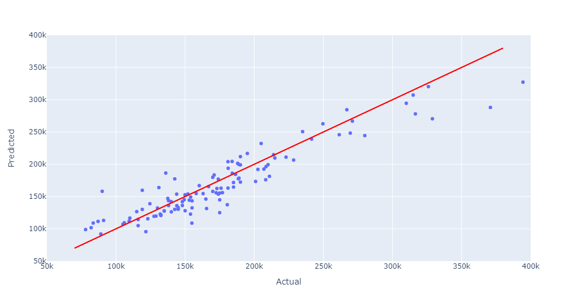
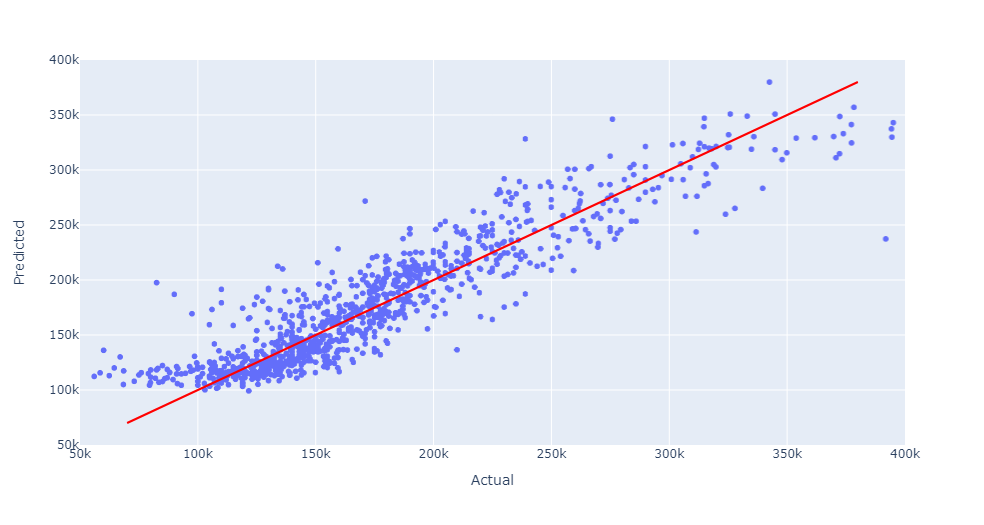

# Property price predictor
This repository is created as a solution of the Predictive Analytics - Portfolio Projects for the "Diploma in Full Stack Software Development" course held at Code Institute
## Project goals
The goal of the project is to develop an application based on a fictional scenario.
### The scenario
An individual, Lydia Doe has inherited four houses in Ames, Iowa, USA. She has an excellent understanding of property prices, but her knowledge has a territorial bias, since she is not from the USA. She has ordered an analysis of the property values in Iowa based on data, she have gathered from the internet.
### Goals
Lydia wants to maximize her profits from selling the properties she has inherited, and would like to acquire a better understanding of the contribution of the different features to the price of a given property. 
## Stakeholders
The stakeholders of the project are the following:
- **Lydia** The client
- The developer

The client can benefit from the delivered analysis, because it will highlight the important features of a property, and with this knowledge, she can maximize the profit on the selling of the inherited properties, and later she will be able to enter the real estate market of Ames more conveniently. Furthermore, she will be able to predict the prices of any given property in negligible time, which can easily give her an advantage over other market participants.

## Business requirements - *Business Understanding*
To deliver an application, that will satisfy the needs of the customer there is a need to make and fulfil requirements. In this project, the functional requirements are the following:
- R1: The delivered analysis should contain the contribution of each feature to the price of the property
- R2: The delivered application shall be able to predict house prices based on the value of features given by the user

Extra functional requirements are the following:
- Re1: The application should make the prediction based on the user given information in less than 30 seconds
- Re2: The application shall visualize the results of the analysis
  - Re2.1: The application shall visualize the results of the analysis via plots
  - Re2.2: The application shall describe the results of the analysis via text
- Re3: The application interface shall not contain more than ten plots on one page 

Safety is not considered in the business requirements, since the application has no impact on the physical world.
Security is not considered in the business requirements, since the application does not handle private data.

## Mapping business requirements
### R1:
To satisfy this requirement we need to analyse the data in regard of the correlation between price and all other properties and choose the properties that show high correspondence. 
### R2
To satisfy this requirement we need to use some prediction method.
### Re1
To satisfy this requirement we need to use a prediction method, which can make the prediction in minimal time. Machine Learning methods are known to be fast during prediction. Since the duration of development is long enough, it is not a problem, that the learning time of such methods is high. Considering the size of the data the learning will not take too much time.
### Re2:
To satisfy this requirement we need to build an application with GUI. For this I have chosen streamlit, since it is a framework I am familiar with, and it reduces development time. Furthermore Python data visualization tools can be integrated to it, and it can combine text with plots.
### Re3
To satisfy this requirement I will use streamlit’s paging tool.
## User Interface
The streamlit user face consists the following pages:
- Home
- Analysis
- Prediction
- Predictor
### Home
Overview of the project
### Analysis
Results of the data analysis
### Prediction
Prediction for the inherited properties
### Predictor
A form used for new predictions
## Data
Scenario wise the data is provided to us by the client, who has found it on the internet. The dataset is available at [Kaggle](https://www.kaggle.com/datasets/codeinstitute/housing-prices-data)
### Data Description
|Variable|Meaning|Units|
|:----|:----|:----|
|1stFlrSF|First Floor square feet|334 - 4692 - (Min - Max > Sq. ft.)|
|2ndFlrSF|Second floor square feet|0 - 2065 - (Min - Max > Sq. ft.)|
|BedroomAbvGr|Bedrooms above grade (does NOT include basement bedrooms)|0 - 8 - (Min - Max > Bedrooms)|
|BsmtExposure|Refers to walkout or garden level walls|Gd: Good Exposure; Av: Average Exposure; Mn: Minimum Exposure; No: No Exposure; None: No Basement|
|BsmtFinType1|Rating of basement finished area|GLQ: Good Living Quarters; ALQ: Average Living Quarters; BLQ: Below Average Living Quarters; Rec: Average Rec Room; LwQ: Low Quality; Unf: Unfinished; None: No Basement|
|BsmtFinSF1|Type 1 finished square feet|0 - 5644 - (Min - Max > Sq. ft.)|
|BsmtUnfSF|Unfinished square feet of basement area|0 - 2336 - (Min - Max > Sq. ft.)|
|TotalBsmtSF|Total square feet of basement area|0 - 6110 - (Min - Max > Sq. ft.)|
|GarageArea|Size of garage in square feet|0 - 1418 - (Min - Max > Sq. ft.)|
|GarageFinish|Interior finish of the garage|Fin: Finished; RFn: Rough Finished; Unf: Unfinished; None: No Garage|
|GarageYrBlt|Year garage was built|1900 - 2010 - (Min - Max > Year Built)|
|GrLivArea|Above grade (ground) living area square feet|334 - 5642 - (Min - Max > Sq. ft.)|
|KitchenQual|Kitchen quality|Ex: Excellent; Gd: Good; TA: Typical/Average; Fa: Fair; Po: Poor|
|LotArea| Lot size in square feet|1300 - 215245 - (Min - Max > Sq. ft.)|
|LotFrontage| Linear feet of street connected to property|21 - 313 - (Min - Max > Lin. ft.)|
|MasVnrArea|Masonry veneer area in square feet|0 - 1600 - (Min - Max > Sq. ft.)|
|EnclosedPorch|Enclosed porch area in square feet|0 - 286 - (Min - Max > Sq. ft.)|
|OpenPorchSF|Open porch area in square feet|0 - 547 - (Min - Max > Sq. ft.)|
|OverallCond|Rates the overall condition of the house|10: Very Excellent; 9: Excellent; 8: Very Good; 7: Good; 6: Above Average; 5: Average; 4: Below Average; 3: Fair; 2: Poor; 1: Very Poor|
|OverallQual|Rates the overall material and finish of the house|10: Very Excellent; 9: Excellent; 8: Very Good; 7: Good; 6: Above Average; 5: Average; 4: Below Average; 3: Fair; 2: Poor; 1: Very Poor|
|WoodDeckSF|Wood deck area in square feet|0 - 736 - (Min - Max > Sq. ft.)|
|YearBuilt|Original construction date|1872 - 2010 - (Min - Max > Year Built)|
|YearRemodAdd|Remodel date (same as construction date if no remodelling or additions)|1950 - 2010 - (Min - Max > Remodel Year)|
|SalePrice|Sale Price|34.900 - 755.000 - (Min - Max > Sale price in $)|
## Machine Learning Pipeline
### Preliminary data analysis
In this phase, the data is analysed in regard of the following aspects:
- Each features correspondence to the price
- Missing data fields
- Outliers
After the analysis the properties with low correspondence have been removed from the dataset. A column with low correspondence was removed, because it contained a huge amount of missing data. In this case various replacement was considered and implemented, none of them have increased the accuracy of the results. Records that had missing values after removing the column were disposed. Outliers have been removed.
### Training Phase
#### Data Preparation
The data had been split up. First the target variable had been separated from the features, and after that the data was split into train and test sets.
#### Neural network
I have chosen to use a simple neural network for the prediction. The neural network uses Mean Squared Error as loss function. It contains a normalization and multiple dense hidden layers. It applies early stopping and multiple dropout layers to address overfitting. The output is the predicted price
### Prediction Phase
The user given data is given to the neural network and the output is calculated.
## Results
### Machine Learning Model
The R2 scores on the test and training sets are the following:
- Test set: 0.8163386948559394
- Train set: 0.8575032708782147

The prediction and actual values are the following:

on the test set:

on the training set:

## Credit

* I would like to say thank you to my mentor, Marcel , for being patient and helpful throughout the whole project.
* Also would like to say thank you to my tutor, Szabolcs Weyde, who explained to me the ins and outs of Data Analytics. 
* I have had some inspiration from [Van-essa](https://github.com/van-essa/heritage-housing-issues#readme) and [Vasi](https://github.com/Vasi012/PP5-Predictive-Analysis).

